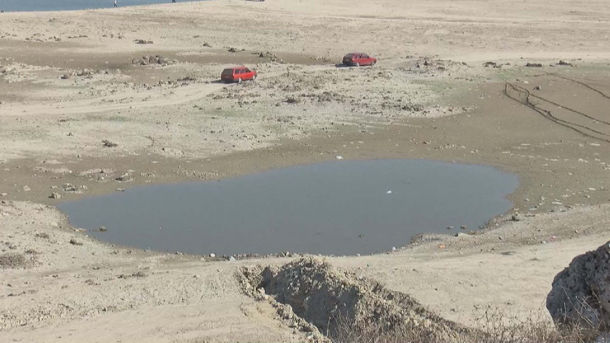

```{r setup, include=FALSE}
knitr::opts_chunk$set(echo = FALSE)
```

```{r libraries, message = FALSE}
library(ggplot2)
library(lubridate)
library(paletteer)
library(ggpubr)
```

```{r cute color}
color.palette <- paletteer_d("ggsci::default_aaas")
```


### Why am I doing this?
Istanbul is a metropolitan city with over 15 million people living in it. 
As of January 2021, there were many news in the national media about a possible drought in the city! 
So, I was curious to know whether these news were an over-reaction or not and what the data tell us about it. 




### What is this data?
I found my dataset from https://data.ibb.gov.tr/. It has the dam occupancy and reserved water levels of Istanbul over 15 years!  
So, I think it is a good way to start the analyses, let's take a look what it includes:
```{r load data}
# load the latest data from url
water.levels <- read.csv("https://data.ibb.gov.tr/dataset/19c14482-14f2-4803-b4df-4cf4c6c42016/resource/b68cbdb0-9bf5-474c-91c4-9256c07c4bdf/download/dam_occupancy.csv")

# let's see what we have
knitr::kable(head(water.levels))
```

```{r add dates, }
dates <- as.Date(water.levels$DATE)
water.levels <- cbind(water.levels, Month = month(dates), Year = year(dates))
```

### Occupancy Levels
Let's see what is the occupancy percentages over last 15 years.
```{r plot dam occupancy levels , message=FALSE}
ggplot(water.levels, aes(as.Date(DATE), GENERAL_DAM_OCCUPANCY_RATE)) + 
    geom_line(size = 1.5, color = color.palette[1]) + 
    xlab("Years") + ylab("Dam Occupancy %") + 
    scale_x_date(date_labels = "%Y", date_minor_breaks = "1 year", date_breaks = "1 year") +
    geom_hline(yintercept=min(water.levels$GENERAL_DAM_OCCUPANCY_RATE), linetype="dashed", color = color.palette[2]) +
    theme_minimal()  + theme(axis.text.x = element_text(angle = 45, vjust = 0.5)) +
    geom_smooth (alpha=0.5, size=0, span=0.5)
```

What does this graph tell us? Well, actually not much except Istanbul was about to have no water at all in the late `2007` where the levels were low as %9.2! Otherwise, this is just a percentage graph, which does not really tell us how much water Istanbul actually had in these years. So, let's take a look at the actual reserve levels.

```{r plot dam reserve levels, message=FALSE}
ggplot(water.levels, aes(as.Date(DATE), GENERAL_DAM_RESERVED_WATER)) + 
    geom_line(size = 1.5, color = color.palette[5]) + 
    xlab("Years") + ylab (expression(paste("Dam Reserve Levels (million ", m^3,")", sep=""))) + 
    scale_x_date(date_labels = "%Y", date_minor_breaks = "1 year", date_breaks = "1 year") +
    theme_minimal()  + theme(axis.text.x = element_text(angle = 45, vjust = 0.5)) + 
    geom_smooth (alpha=0.5, size=0, span=0.5)
```

The most obvious thing to notice here is that this graph is identical to the earlier percentage graph which suggest the following two possibilities:

> 
1) The data is completely trash
2) There was not even a single dam built for the last 15 years!


### Dams in Istanbul
To understand which one of the two possibilities is true, I have looked into the dams in Istanbul. According to [wikipedia](https://tr.wikipedia.org/wiki/Kategori:%C4%B0stanbul%27daki_barajlar) there are 7 dams in the city.

- [Alibey](https://tr.wikipedia.org/wiki/Alibey_Baraj%C4%B1) (1975-1983)
- [Büyükçekmece](https://tr.wikipedia.org/wiki/B%C3%BCy%C3%BCk%C3%A7ekmece_Baraj%C4%B1) (1983-1988)
- [Darlık](https://tr.wikipedia.org/wiki/Darl%C4%B1k_Baraj%C4%B1) (1986-1988)
- [Elmalı-2](https://tr.wikipedia.org/wiki/Elmal%C4%B1-2_Baraj%C4%B1) (1952-1955)
- [Ömerli](https://tr.wikipedia.org/wiki/%C3%96merli_Baraj%C4%B1) (1968 - 1973)
- [Sazlıdere](https://tr.wikipedia.org/wiki/Sazl%C4%B1dere_Baraj%C4%B1) (1991-1996)
- [Terkos](https://tr.wikipedia.org/wiki/Terkos_Baraj%C4%B1) (1971)

and none of which was built after 1996. So, it has been `25` years that a single dam is built in the city. I was just sad at this point.    
Yet, I have decided to move on with my analyses.

### Population of Istanbul
So far, we only had the data for the reserve levels. 
However, without knowing the actual population of the city, it is not clear if there is an actual drought or not.
I have downloaded the population of the city over the years from https://biruni.tuik.gov.tr/. Unfortunately, the data starts from 2007 and it lacks 2020, so I imputed the missing values using linear regression. In the end the population of Istanbul looks like this:

```{r}
library(readxl)
pop.ist <- read_excel("Istanbul_population.xls")
ggplot(pop.ist, aes(Year, Population/1e6)) + geom_line(group = 1, size = 2) + 
    ylab("Population (in millions)") + theme_minimal() 
```

So, as expected Istanbul gets more crowded over the years, which means there is less water sources per individual. Then, the question becomes `how much less`? To answer this let's take a look at the following graph:

```{r message=FALSE}
water.levels <- merge(water.levels, pop.ist, by = "Year")

# million m3 / population = m3/per individual
water.levels$Average.water <- water.levels$GENERAL_DAM_RESERVED_WATER*1e6/water.levels$Population

ggplot(water.levels, aes(as.Date(DATE), Average.water)) + 
    geom_line(size = 1.5, color = color.palette[7]) + 
    xlab("Years") + ylab (expression(paste("Water Resources (", m^3,"/per individual)", sep=""))) + 
    scale_x_date(date_labels = "%Y", date_minor_breaks = "1 year", date_breaks = "1 year") +
    theme_minimal()  + theme(axis.text.x = element_text(angle = 45, vjust = 0.5)) + 
    geom_smooth (alpha=0.5, size=0, span=0.5)
```

This plot shows the average $m^3$ of water each individual have over the years in the city. 
Clearly, the recent levels are alarming as the average levels are under 20 $m^3$/individual and there is a clear decreasing trend over the years. 

### Conclusions (TLDR)

- Istanbul needs new dams!
- People should be more thoughtful about their water consumptions (at least till having a new dam)

### Limitations
- The dam reserve level data is provided with 45 days latency, therefore it is not the best indicator of a drought of the current day. However, I think it is a good indicator of how is Istanbul doing in general.

- There is no official source of the population information, so I calculated it using linear regression.

### Code availability
You can find all resources and code snippets here: [link]()
